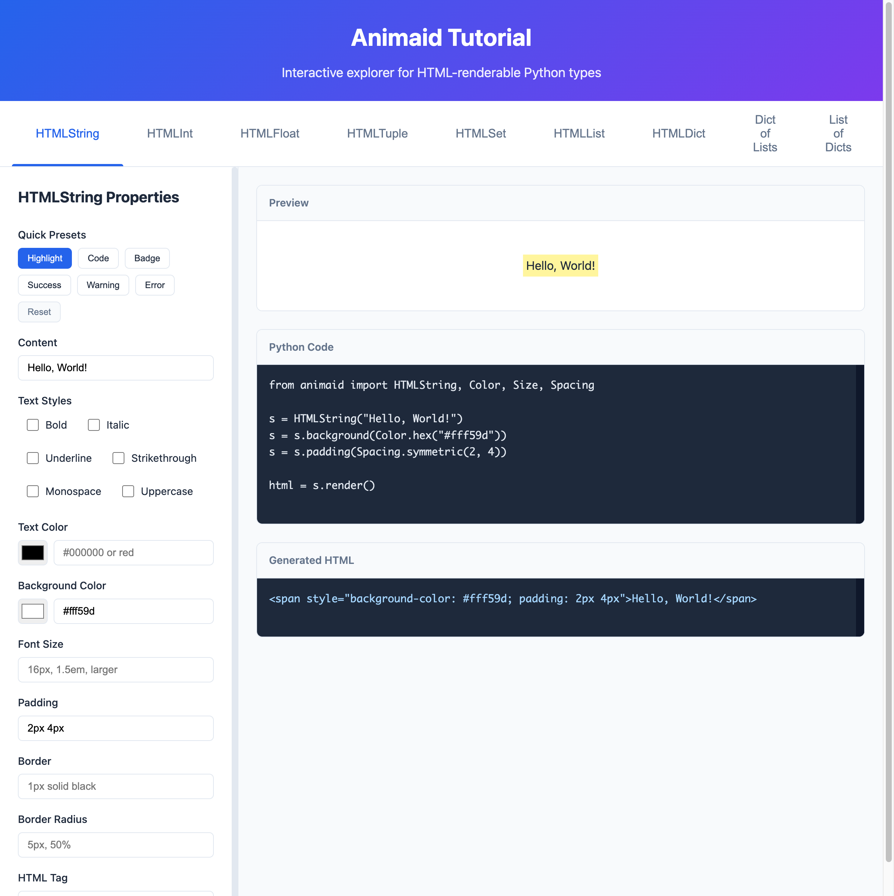
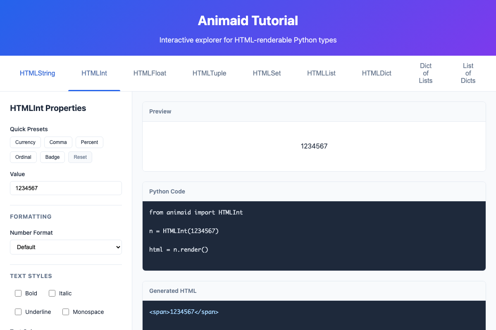
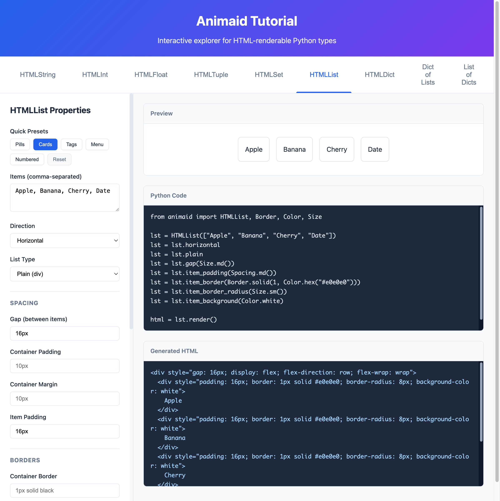
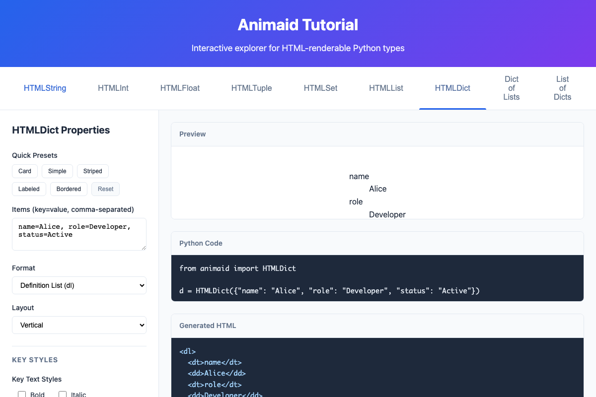
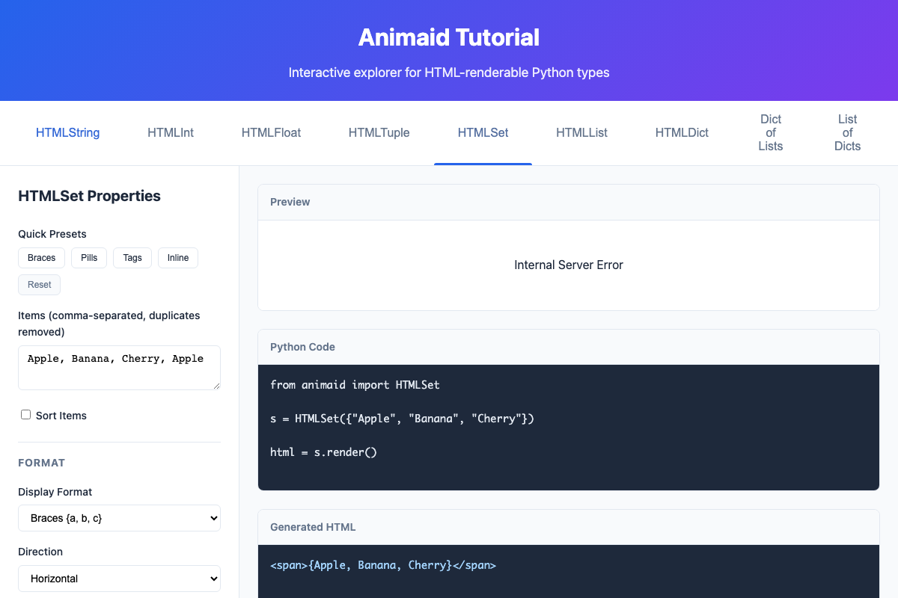

# AnimAID

**Turn Python data structures into beautiful HTML with zero effort.**

AnimAID is a Python library that wraps common data types (strings, numbers, lists, dicts, tuples, sets) and gives them the ability to render themselves as styled HTML. It's perfect for:

- Building interactive tutorials and documentation
- Creating quick web dashboards
- Generating HTML reports
- Learning web development concepts through Python

## Quick Start

### Installation

```bash
pip install animaid
```

### Your First Styled String

```python
from animaid import HTMLString

# Create a styled string
greeting = HTMLString("Hello, World!")
greeting = greeting.bold.color("blue")

# Get the HTML
print(greeting.render())
# Output: <span style="font-weight: bold; color: blue">Hello, World!</span>
```

That's it! You just created styled HTML from Python.

## What Can AnimAID Do?

AnimAID provides HTML-renderable versions of Python's built-in types:

| Python Type | AnimAID Type | What It Does |
|-------------|--------------|--------------|
| `str` | `HTMLString` | Style text with colors, fonts, backgrounds |
| `int` | `HTMLInt` | Format numbers with commas, currency, percentages |
| `float` | `HTMLFloat` | Control decimal places, add units |
| `list` | `HTMLList` | Render as styled lists, cards, or pills |
| `dict` | `HTMLDict` | Display as tables, cards, or definition lists |
| `tuple` | `HTMLTuple` | Show tuples with labels or custom separators |
| `set` | `HTMLSet` | Render unique items as tags or pills |

## Learning by Example

### Styling Text (HTMLString)

```python
from animaid import HTMLString

# Basic styling
text = HTMLString("Important!")
text = text.bold.italic.color("red")
print(text.render())
```

You can chain multiple styles together:

```python
# Chaining styles
badge = (HTMLString("NEW")
    .uppercase
    .bold
    .padding("4px 8px")
    .background("#4CAF50")
    .color("white")
    .border_radius("4px"))
```



### Formatting Numbers (HTMLInt)

```python
from animaid import HTMLInt

# Display as currency
price = HTMLInt(1234567)
price = price.currency("$").bold.color("#2e7d32")
print(price.render())
# Output: $1,234,567
```

Common number formats:
- `.comma()` - Add thousand separators: 1,234,567
- `.currency("$")` - Format as money: $1,234,567
- `.percent()` - Show as percentage: 85%
- `.ordinal()` - Show as ordinal: 1st, 2nd, 3rd



### Creating Lists (HTMLList)

```python
from animaid import HTMLList

# Simple list
fruits = HTMLList(["Apple", "Banana", "Cherry"])
print(fruits.render())

# Styled as horizontal cards
cards = (HTMLList(["Apple", "Banana", "Cherry", "Date"])
    .horizontal
    .plain
    .gap("16px")
    .item_padding("16px")
    .item_border("1px solid #e0e0e0")
    .item_border_radius("8px"))
```



### Displaying Dictionaries (HTMLDict)

```python
from animaid import HTMLDict

# User profile as a card
profile = HTMLDict({
    "name": "Alice",
    "role": "Developer",
    "status": "Active"
})

styled = (profile
    .as_divs
    .key_bold
    .padding("16px")
    .border("1px solid #e0e0e0")
    .border_radius("8px")
    .background("white"))
```



### Working with Sets (HTMLSet)

Sets automatically remove duplicates:

```python
from animaid import HTMLSet

# Duplicates are removed automatically
tags = HTMLSet(["Python", "Web", "Python", "HTML"])
# Only contains: Python, Web, HTML

# Style as pills
pills = tags.pills  # Rounded pill-style items
```



## The Fluent API

AnimAID uses a "fluent" API where methods return new objects, letting you chain calls:

```python
# Method chaining
result = (HTMLString("Hello")
    .bold
    .italic
    .color("blue")
    .padding("10px")
    .border("1px solid black"))
```

Each method returns a new object with the style applied, so you can also do:

```python
# Step by step
text = HTMLString("Hello")
text = text.bold
text = text.color("blue")
```

Both approaches work the same way!

## Quick Style Presets

Many types come with presets for common use cases:

```python
# String presets
HTMLString("Note").highlight   # Yellow background
HTMLString("def foo").code     # Monospace, dark background
HTMLString("3").badge          # Circular badge style

# Number presets
HTMLInt(99).currency("$")      # $99 in green
HTMLInt(42).badge              # Circular number badge

# List presets
HTMLList(items).pills          # Rounded pill items
HTMLList(items).cards          # Card-style items
HTMLList(items).tags           # Tag-style items

# Set presets
HTMLSet(items).pills           # Pill-style unique items
HTMLSet(items).tags            # Tag-style items
```

## CSS Helper Types

AnimAID includes helper types for CSS values:

```python
from animaid import Color, Size, Spacing, Border

# Colors
Color.red                    # Named color
Color.hex("#4CAF50")         # Hex color
Color.rgb(100, 150, 200)     # RGB color

# Sizes
Size.px(16)                  # 16px
Size.em(1.5)                 # 1.5em
Size.sm()                    # Small preset (8px)
Size.md()                    # Medium preset (16px)

# Spacing
Spacing.px(10)               # 10px all around
Spacing.symmetric(10, 20)    # 10px top/bottom, 20px left/right

# Borders
Border.solid(1, Color.gray)  # 1px solid gray
Border.dashed(2, Color.red)  # 2px dashed red
```

## Interactive Tutorial

AnimAID includes a web-based tutorial that lets you experiment with all the features:

```bash
# Start the tutorial server
cd tutorial
uv run uvicorn app:app --reload
```

Then open http://localhost:8000 in your browser.

The tutorial provides:
- Live preview of styled output
- Generated Python code you can copy
- Generated HTML output
- Quick preset buttons

## Type Aliases

For convenience, AnimAID provides short aliases:

```python
from animaid import String, Int, Float, List, Dict, Tuple, Set

# These are equivalent:
HTMLString("hello")  # Full name
String("hello")      # Short alias
```

## Common Styling Methods

Most AnimAID types share these styling methods:

| Method | Example | Description |
|--------|---------|-------------|
| `.bold` | `.bold` | Make text bold |
| `.italic` | `.italic` | Make text italic |
| `.color(c)` | `.color("red")` | Set text color |
| `.background(c)` | `.background("#f0f0f0")` | Set background color |
| `.padding(p)` | `.padding("10px")` | Add padding |
| `.margin(m)` | `.margin("5px")` | Add margin |
| `.border(b)` | `.border("1px solid black")` | Add border |
| `.border_radius(r)` | `.border_radius("5px")` | Round corners |
| `.font_size(s)` | `.font_size("18px")` | Set font size |

## Development

```bash
# Clone the repository
git clone https://github.com/jdrumgoole/animaid.git
cd animaid

# Install with development dependencies
uv pip install -e ".[dev,docs]"

# Run tests
invoke test

# Run all checks (tests, linting, type checking)
invoke check

# Build documentation
invoke docs

# Start the tutorial server
invoke tutorial-start
```

## Requirements

- Python 3.10+
- No external dependencies for the core library

## License

MIT License - see [LICENSE](LICENSE) for details.

## Contributing

Contributions are welcome! Please feel free to submit a Pull Request.

1. Fork the repository
2. Create your feature branch (`git checkout -b feature/amazing-feature`)
3. Run the tests (`invoke test`)
4. Commit your changes (`git commit -m 'Add amazing feature'`)
5. Push to the branch (`git push origin feature/amazing-feature`)
6. Open a Pull Request
