# Animaid

A GUI toolkit for animating Python data structures.

## Overview

Animaid provides tools to visualize and render Python data structures as styled HTML for educational and presentation purposes. It includes classes that subclass Python's built-in types:

- **HTMLString** - A `str` subclass for rendering styled text
- **HTMLInt** - An `int` subclass for formatted numbers (currency, percentages, ordinals)
- **HTMLFloat** - A `float` subclass for decimal formatting and units
- **HTMLList** - A `list` subclass for rendering lists with layout options
- **HTMLDict** - A `dict` subclass for rendering key-value pairs
- **HTMLTuple** - A `tuple` subclass with support for named tuples
- **HTMLSet** - A `set` subclass for rendering unique items as tags or pills
- **Animate** - A Tkinter-like interactive GUI environment using HTML

All classes support a fluent API for chaining style methods and are compatible with [Jinja2](https://jinja.palletsprojects.com/) templates via the `__html__()` protocol.

The `Animate` class provides a real-time browser-based display where you can add, update, and remove AnimAID objects programmatically with live updates via WebSocket.

## Installation

```bash
pip install animaid
```

Or for development:

```bash
git clone https://github.com/jdrumgoole/animaid.git
cd animaid
uv pip install -e ".[dev,docs]"
```

## Quick Start

### HTMLString

Style text with CSS properties:

```python
from animaid import HTMLString, Color, Size

# Basic styling with strings
s = HTMLString("Hello, World!").bold().color("blue")
print(s.render())
# <span style="font-weight: bold; color: blue">Hello, World!</span>

# Using CSS types for type-safe styling
styled = (
    HTMLString("Important!")
    .bold()
    .italic()
    .color(Color.red)
    .background(Color.hex("#ffff00"))
    .padding(Size.px(10))
)
```

### HTMLList

Render lists with flexible layouts:

```python
from animaid import HTMLList, Size, Color, Border

# Horizontal list with styled items
items = HTMLList(["Apple", "Banana", "Cherry"])
items = items.horizontal().gap(Size.px(10)).item_padding(Size.px(8))
print(items.render())

# Grid layout with CSS types
grid = (
    HTMLList(["A", "B", "C", "D", "E", "F"])
    .grid(3)
    .gap(Size.px(5))
    .item_border(Border().solid().color(Color.gray))
)
```

### HTMLDict

Display key-value pairs in multiple formats:

```python
from animaid import HTMLDict, Color, Size, Border

# Definition list format (default)
d = HTMLDict({"name": "Alice", "role": "Developer"})
d = d.key_bold().key_color(Color.hex("#333")).value_color(Color.hex("#666"))
print(d.render())

# Table format
table = HTMLDict({"x": 1, "y": 2, "z": 3}).as_table()

# Card layout with CSS types
card = (
    HTMLDict({"Name": "Alice", "Email": "alice@example.com"})
    .key_bold()
    .padding(Size.px(12))
    .border(Border().solid().color(Color.hex("#ccc")))
    .border_radius(Size.px(8))
)
```

### HTMLInt

Format integers with various display options:

```python
from animaid import HTMLInt

# Basic integer with styling
n = HTMLInt(42).bold().blue()
print(n.render())
# <span style="font-weight: bold; color: blue">42</span>

# Thousand separators
HTMLInt(1234567).comma().render()
# <span>1,234,567</span>

# Currency formatting
HTMLInt(1999).currency("$").bold().green()
# <span style="font-weight: bold; color: green">$1,999</span>

# Percentage
HTMLInt(85).percent().render()
# <span>85%</span>

# Ordinal numbers
HTMLInt(1).ordinal().render()   # "1st"
HTMLInt(2).ordinal().render()   # "2nd"
HTMLInt(3).ordinal().render()   # "3rd"

# Badge preset (circular number badge)
HTMLInt(42).badge()
```

### HTMLFloat

Format floating-point numbers with precision control:

```python
from animaid import HTMLFloat

# Basic float with styling
f = HTMLFloat(3.14159).bold().render()
# <span style="font-weight: bold">3.14159</span>

# Control decimal places
HTMLFloat(3.14159).decimal(2).render()
# <span>3.14</span>

# Thousand separators
HTMLFloat(1234567.89).comma().render()
# <span>1,234,567.89</span>

# Percentage (multiplies by 100)
HTMLFloat(0.856).percent().render()
# <span>85.60%</span>

# Currency
HTMLFloat(19.99).currency("$").render()
# <span>$19.99</span>

# Scientific notation
HTMLFloat(0.000123).scientific().render()
# <span>1.23e-04</span>

# Add units
HTMLFloat(72.5).unit("kg").render()
# <span>72.5 kg</span>
```

### HTMLTuple

Render tuples with flexible layouts and named tuple support:

```python
from animaid import HTMLTuple
from collections import namedtuple

# Basic tuple
t = HTMLTuple((1, 2, 3))
t.render()
# <div>(1, 2, 3)</div>

# Horizontal layout with pills
HTMLTuple(("Red", "Green", "Blue")).horizontal().pills()

# Vertical layout
HTMLTuple(("First", "Second", "Third")).vertical().gap("8px")

# Named tuple support with labels
Point = namedtuple('Point', ['x', 'y'])
HTMLTuple(Point(10, 20)).labeled()
# Renders as: x: 10, y: 20

# Custom separator
HTMLTuple((1, 2, 3)).separator(" | ")
# <div>1 | 2 | 3</div>

# Without parentheses
HTMLTuple((1, 2, 3)).plain()
# <div>1, 2, 3</div>
```

### HTMLSet

Render unique items as tags or pills:

```python
from animaid import HTMLSet

# Basic set (duplicates automatically removed)
tags = HTMLSet(["Python", "Web", "Python", "HTML"])
# Only contains: Python, Web, HTML

# Pills preset (rounded pill-style items)
HTMLSet({"python", "javascript", "rust"}).pills()

# Tags preset
HTMLSet({"urgent", "bug", "help-wanted"}).tags()

# Horizontal layout with gap
HTMLSet({"A", "B", "C"}).horizontal().gap("10px")

# Custom item styling
HTMLSet({"one", "two", "three"}).item_background("#e3f2fd").item_padding("8px 12px")
```

HTMLSet is reactive - when used with Animate, adding or removing items automatically updates the browser:

```python
from animaid import Animate, HTMLSet

with Animate() as anim:
    tags = HTMLSet({"python"}).pills()
    anim.add(tags)

    tags.add("javascript")  # Browser updates automatically
    tags.add("rust")        # Browser updates automatically
    tags.discard("python")  # Browser updates automatically
```

### Nested Structures

Combine types for complex visualizations:

```python
from animaid import HTMLDict, HTMLList, Size, Border, Color

# Dict of Lists
categories = HTMLDict({
    "Fruits": HTMLList(["Apple", "Banana"]).horizontal().gap(Size.px(8)),
    "Vegetables": HTMLList(["Carrot", "Broccoli"]).horizontal().gap(Size.px(8)),
}).key_bold()

# List of Dicts (cards)
card_border = Border().solid().color(Color.hex("#ddd"))
cards = HTMLList([
    HTMLDict({"Name": "Alice", "Role": "Dev"}).key_bold().padding(Size.px(10)).border(card_border),
    HTMLDict({"Name": "Bob", "Role": "Design"}).key_bold().padding(Size.px(10)).border(card_border),
]).horizontal().gap(Size.px(16))
```

## CSS Types

Animaid provides type-safe CSS value classes that can be used instead of raw strings. These provide better IDE autocomplete, validation, and documentation.

### Size

Create CSS size values with explicit units:

```python
from animaid import Size

Size.px(16)       # "16px"
Size.em(1.5)      # "1.5em"
Size.rem(2)       # "2rem"
Size.percent(50)  # "50%"
Size.vh(100)      # "100vh"
Size.vw(80)       # "80vw"
Size.auto()       # "auto"
```

### Color

Create CSS color values with validation:

```python
from animaid import Color

# Named colors
Color.red         # "red"
Color.blue        # "blue"

# Hex colors
Color.hex("#ff0000")   # "#ff0000"
Color.hex("00f")       # "#00f" (auto-adds #)

# RGB/RGBA
Color.rgb(255, 0, 0)        # "rgb(255, 0, 0)"
Color.rgba(255, 0, 0, 0.5)  # "rgba(255, 0, 0, 0.5)"

# HSL/HSLA
Color.hsl(120, 100, 50)       # "hsl(120, 100%, 50%)"
Color.hsla(120, 100, 50, 0.5) # "hsla(120, 100%, 50%, 0.5)"
```

### Border

Create CSS border values with a fluent API:

```python
from animaid import Border, BorderStyle, Color, Size

# Using constructor
Border(Size.px(1), BorderStyle.SOLID, Color.black)  # "1px solid black"

# Using fluent API
Border().width(2).solid().color("red")    # "2px solid red"
Border().dashed().color(Color.blue)       # "1px dashed blue"

# Factory methods
Border.solid(2, "black")   # "2px solid black"
Border.dashed(1, "gray")   # "1px dashed gray"
```

### Spacing

Create CSS spacing values (padding, margin) for 1-4 edges:

```python
from animaid import Spacing, Size

# Single value (all edges)
Spacing.all(10)              # "10px"

# Two values (vertical, horizontal)
Spacing.symmetric(10, 20)    # "10px 20px"

# Four values (top, right, bottom, left)
Spacing.edges(10, 20, 10, 20)  # "10px 20px 10px 20px"

# Using Size values
Spacing.symmetric(Size.rem(1), Size.rem(2))  # "1rem 2rem"
```

### Enums

CSS enum values for constrained properties:

```python
from animaid import (
    Display, FlexDirection, AlignItems, JustifyContent,
    FontWeight, FontStyle, TextAlign, TextDecoration
)

# Display
Display.FLEX, Display.GRID, Display.BLOCK, Display.INLINE

# Flexbox
FlexDirection.ROW, FlexDirection.COLUMN
AlignItems.CENTER, AlignItems.STRETCH
JustifyContent.SPACE_BETWEEN, JustifyContent.CENTER

# Typography
FontWeight.BOLD, FontWeight.NORMAL
FontStyle.ITALIC, FontStyle.NORMAL
TextAlign.CENTER, TextAlign.LEFT
TextDecoration.UNDERLINE, TextDecoration.LINE_THROUGH
```

### Backward Compatibility

All methods accept both CSS types and raw strings:

```python
from animaid import HTMLString, Color, Size

# Both work identically:
HTMLString("Hello").color("red")        # Using string
HTMLString("Hello").color(Color.red)    # Using CSS type

HTMLString("Hello").font_size("16px")   # Using string
HTMLString("Hello").font_size(Size.px(16))  # Using CSS type
```

## Animate - Interactive Display

The `Animate` class provides a Tkinter-like interactive GUI environment using HTML. The browser becomes the display surface, and AnimAID objects become widgets that can be added, updated, and removed programmatically with real-time visual feedback.

### Basic Usage

```python
from animaid import Animate, HTMLString, HTMLList

# Create and start the server (opens browser automatically)
anim = Animate()
anim.run()

# Add items - browser updates in real-time
anim.add(HTMLString("Hello World!").bold().xl())
anim.add(HTMLString("This updates live").italic().blue())
anim.add(HTMLList(["Apple", "Banana", "Cherry"]).pills())

# Update an existing item
item_id = anim.add(HTMLString("Loading...").muted())
anim.update(item_id, HTMLString("Done!").success())

# Remove items - by ID or by object
anim.remove(item_id)  # By ID
anim.remove(my_item)  # By object reference
anim.clear(my_item)   # Alias for remove
anim.clear_all()      # Clear all items

# Stop the server when done
anim.stop()
```

### Context Manager

Use the context manager for automatic cleanup:

```python
from animaid import Animate, HTMLString

with Animate() as anim:
    anim.add(HTMLString("Temporary display").bold())
    anim.add(HTMLString("Server stops when context exits").muted())
    input("Press Enter to exit...")
# Server stops automatically when context exits
```

### Configuration Options

```python
# Custom port and title
anim = Animate(port=8300, title="My App")

# Disable auto-opening browser
anim = Animate(auto_open=False)
anim.run()
print(f"Open browser at: {anim.url}")
```

### API Methods

| Method | Description |
|--------|-------------|
| `run()` | Start server and open browser |
| `stop()` | Stop the server |
| `add(item, id=None)` | Add item, returns ID |
| `update(id, item)` | Update item by ID |
| `remove(item_or_id)` | Remove item by ID or object |
| `clear(item_or_id)` | Remove item by ID or object (alias for remove) |
| `clear_all()` | Remove all items |
| `get(id)` | Get item by ID |
| `items()` | Get all (id, item) pairs |
| `refresh(id)` | Re-render and broadcast a single item |
| `refresh_all()` | Re-render and broadcast all items |

### Properties

| Property | Description |
|----------|-------------|
| `url` | Server URL (e.g., `http://127.0.0.1:8200`) |
| `is_running` | Whether server is running |
| `title` | Display title |
| `port` | Server port |

### Installation

The `Animate` class requires the tutorial dependencies:

```bash
pip install animaid[tutorial]
# or with uv
uv pip install animaid[tutorial]
```

### Reactive Updates

Mutable HTML objects (`HTMLList`, `HTMLDict`, `HTMLSet`) automatically notify the Animate display when their contents change. This means you can mutate these objects directly and the browser will update in real-time without calling `update()`.

```python
from animaid import Animate, HTMLList, HTMLDict, HTMLSet

anim = Animate()
anim.run()

# Add a mutable list
scores = HTMLList([10, 20, 30]).pills()
anim.add(scores)

# Mutate the list - browser updates automatically!
scores.append(40)      # Browser shows [10, 20, 30, 40]
scores[0] = 100        # Browser shows [100, 20, 30, 40]
scores.pop()           # Browser shows [100, 20, 30]

# Same for dicts
data = HTMLDict({"score": 0, "level": 1}).card()
anim.add(data)
data["score"] = 500    # Browser updates automatically

# And sets
tags = HTMLSet({"python", "html"}).pills()
anim.add(tags)
tags.add("css")        # Browser updates automatically
```

**Styling updates work on all types:** All HTML types (`HTMLString`, `HTMLInt`, `HTMLFloat`, `HTMLTuple`, `HTMLList`, `HTMLDict`, `HTMLSet`) automatically notify Animate when their styles change:

```python
from animaid import Animate, HTMLString, HTMLInt

anim = Animate()
anim.run()

# Style changes trigger automatic updates
message = HTMLString("Hello")
anim.add(message)
message.bold()        # Browser updates automatically
message.red()         # Browser updates automatically

number = HTMLInt(42)
anim.add(number)
number.badge()        # Browser updates automatically
```

**Immutable types need update() for data changes:** Since `HTMLString`, `HTMLInt`, `HTMLFloat`, and `HTMLTuple` inherit from Python's immutable types, you cannot change their underlying data. To display different content, use the `update()` method:

```python
from animaid import Animate, HTMLString

anim = Animate()
anim.run()

message = HTMLString("Loading...").muted()
item_id = anim.add(message)

# Must use update() to change the content (not just style)
anim.update(item_id, HTMLString("Complete!").success())
```

**Manual refresh:** If you modify an object through a method that bypasses the notification system, use `refresh()` or `refresh_all()`:

```python
# Force re-render of a specific item
anim.refresh(item_id)

# Force re-render of all items
anim.refresh_all()
```

## Demo Programs

AnimAID includes several demo programs that showcase its interactive capabilities. Run them to see real-time updates in action!

### Running Demos

List all available demos:
```bash
animaid-demo --list
```

Run a specific demo:
```bash
animaid-demo countdown_timer
```

Or run directly with Python:
```bash
python demos/countdown_timer.py
```

### Available Demos

| Demo | Description | Source |
|------|-------------|--------|
| `countdown_timer` | Real-time countdown with color transitions (green → yellow → red) | [View Code](https://github.com/jdrumgoole/animaid/blob/main/demos/countdown_timer.py) |
| `live_list` | Reactive shopping cart showing `.append()` and `.pop()` | [View Code](https://github.com/jdrumgoole/animaid/blob/main/demos/live_list.py) |
| `score_tracker` | Game score tracking with automatic dict updates | [View Code](https://github.com/jdrumgoole/animaid/blob/main/demos/score_tracker.py) |
| `sorting_visualizer` | Bubble sort algorithm with step-by-step visualization | [View Code](https://github.com/jdrumgoole/animaid/blob/main/demos/sorting_visualizer.py) |
| `dashboard` | Multi-type dashboard with HTMLString, HTMLDict, HTMLList, HTMLSet | [View Code](https://github.com/jdrumgoole/animaid/blob/main/demos/dashboard.py) |
| `typewriter` | Typewriter effect with progressive styling | [View Code](https://github.com/jdrumgoole/animaid/blob/main/demos/typewriter.py) |
| `todo_app` | Interactive todo list with CRUD operations | [View Code](https://github.com/jdrumgoole/animaid/blob/main/demos/todo_app.py) |
| `data_pipeline` | ETL pipeline progress tracking | [View Code](https://github.com/jdrumgoole/animaid/blob/main/demos/data_pipeline.py) |

### Input Widget Demos

| Demo | Description | Source |
|------|-------------|--------|
| `input_button` | Button styles, sizes, and click event handling | [View Code](https://github.com/jdrumgoole/animaid/blob/main/demos/input_button.py) |
| `input_text` | Text input with live typing feedback and validation | [View Code](https://github.com/jdrumgoole/animaid/blob/main/demos/input_text.py) |
| `input_checkbox` | Checkbox toggles and multi-checkbox patterns | [View Code](https://github.com/jdrumgoole/animaid/blob/main/demos/input_checkbox.py) |
| `input_select` | Select dropdowns with dynamic updates | [View Code](https://github.com/jdrumgoole/animaid/blob/main/demos/input_select.py) |
| `input_slider` | RGB color mixer with sliders | [View Code](https://github.com/jdrumgoole/animaid/blob/main/demos/input_slider.py) |
| `input_greeter` | Interactive greeter with text input and button | [View Code](https://github.com/jdrumgoole/animaid/blob/main/demos/input_greeter.py) |
| `input_counter` | Counter with increment/decrement buttons | [View Code](https://github.com/jdrumgoole/animaid/blob/main/demos/input_counter.py) |
| `input_form` | Registration form with multiple input types | [View Code](https://github.com/jdrumgoole/animaid/blob/main/demos/input_form.py) |

### Container Demos

| Demo | Description | Source |
|------|-------------|--------|
| `container_layout` | HTMLRow and HTMLColumn container layouts | [View Code](https://github.com/jdrumgoole/animaid/blob/main/demos/container_layout.py) |
| `container_card` | HTMLCard with shadows, borders, and presets | [View Code](https://github.com/jdrumgoole/animaid/blob/main/demos/container_card.py) |
| `container_divider` | HTMLDivider for visual content separation | [View Code](https://github.com/jdrumgoole/animaid/blob/main/demos/container_divider.py) |
| `container_spacer` | HTMLSpacer for fixed and flexible spacing | [View Code](https://github.com/jdrumgoole/animaid/blob/main/demos/container_spacer.py) |
| `container_row_column` | Flexbox layouts with alignment options | [View Code](https://github.com/jdrumgoole/animaid/blob/main/demos/container_row_column.py) |

Each demo opens a browser window and shows real-time updates as Python code executes.

### Demo Gallery

**Countdown Timer** - Color transitions from green to yellow to red ([source](https://github.com/jdrumgoole/animaid/blob/main/demos/countdown_timer.py))

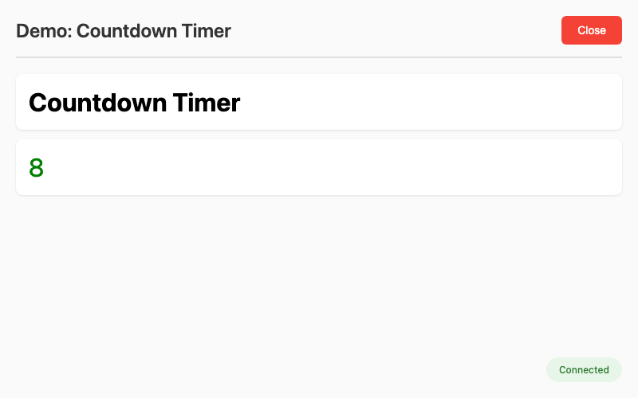

**Sorting Visualizer** - Bubble sort with step-by-step animation ([source](https://github.com/jdrumgoole/animaid/blob/main/demos/sorting_visualizer.py))

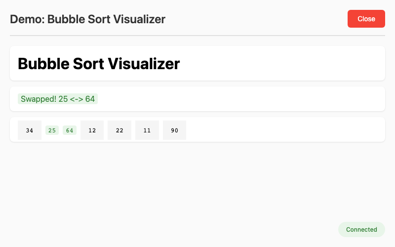

**Dashboard** - Multiple HTML types updating together ([source](https://github.com/jdrumgoole/animaid/blob/main/demos/dashboard.py))

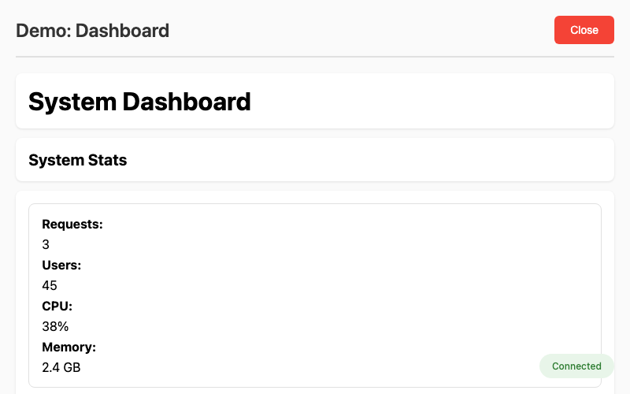

**Todo App** - Interactive task management ([source](https://github.com/jdrumgoole/animaid/blob/main/demos/todo_app.py))

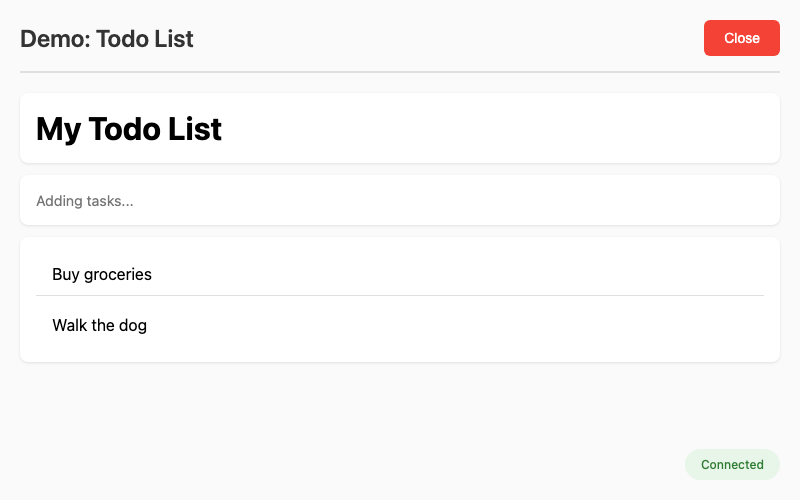

### Input Widget Gallery

**Button Showcase** - Button styles, sizes, and click events ([source](https://github.com/jdrumgoole/animaid/blob/main/demos/input_button.py))

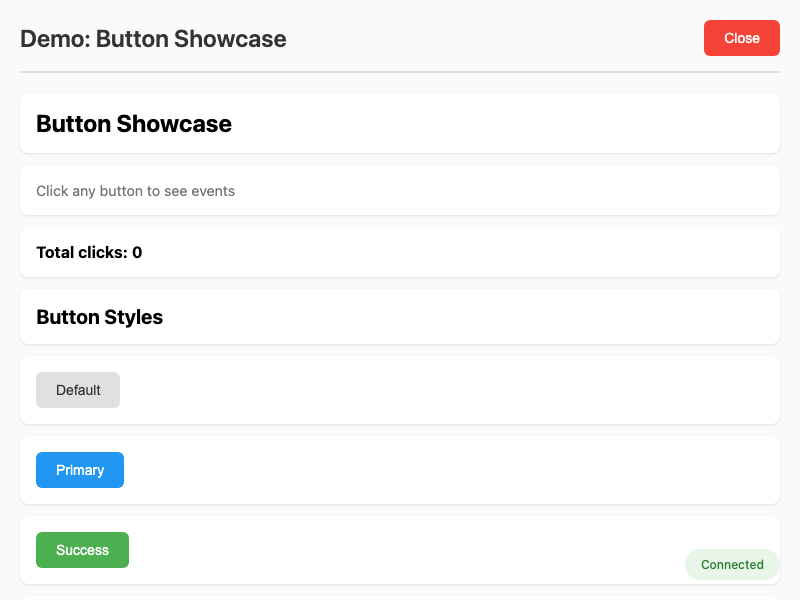

**Text Input** - Live character counting and validation ([source](https://github.com/jdrumgoole/animaid/blob/main/demos/input_text.py))

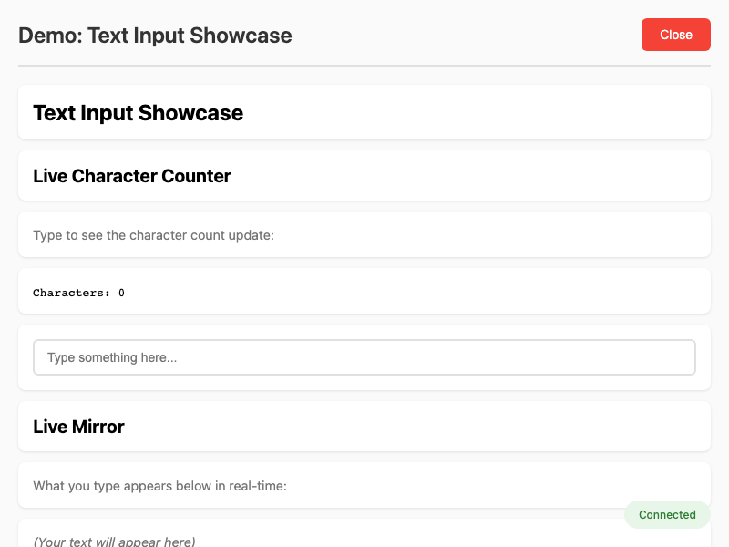

**Checkbox Showcase** - Toggle handling and preferences panel ([source](https://github.com/jdrumgoole/animaid/blob/main/demos/input_checkbox.py))

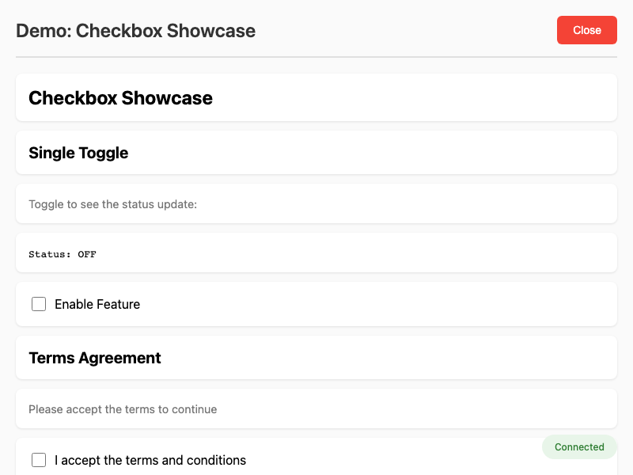

**Select Dropdown** - Dynamic selection with live updates ([source](https://github.com/jdrumgoole/animaid/blob/main/demos/input_select.py))

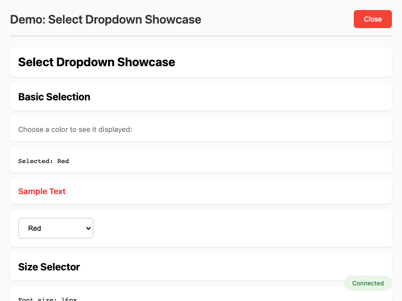

**RGB Color Mixer** - Sliders for real-time color mixing ([source](https://github.com/jdrumgoole/animaid/blob/main/demos/input_slider.py))

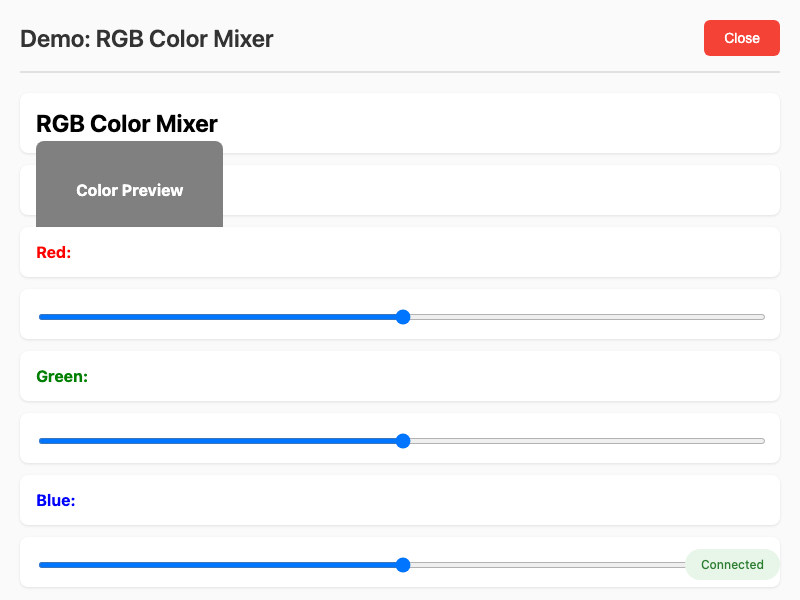

**Interactive Counter** - Increment/decrement with buttons ([source](https://github.com/jdrumgoole/animaid/blob/main/demos/input_counter.py))

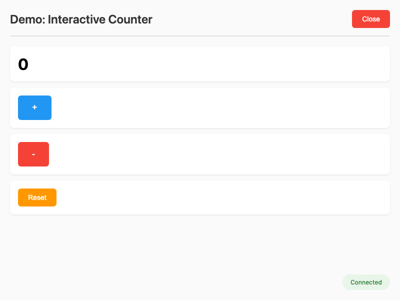

## Interactive Tutorial

AnimAID includes a comprehensive web-based tutorial that lets you explore all features interactively.

### Starting the Tutorial

```bash
# Install with tutorial dependencies
pip install animaid[tutorial]

# Start the tutorial (opens browser automatically)
animaid-tutorial

# Or specify a custom port
animaid-tutorial --port 8300
```

### Tutorial Features

The tutorial provides five main sections:

**Python Objects Tab**
- Unified interface for all HTML types (HTMLString, HTMLList, HTMLDict, HTMLInt, HTMLFloat, HTMLTuple, HTMLSet)
- Dropdown selector to switch between object types
- Type-specific controls and presets
- Live preview, Python code, and HTML output

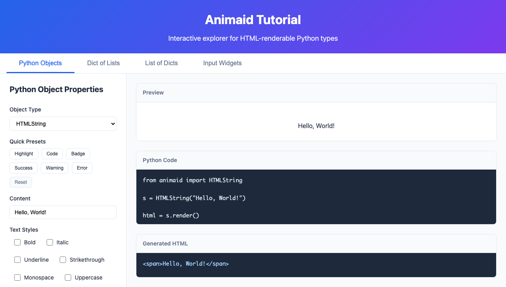

**Input Widgets Tab**
- Interactive input widgets: Button, TextInput, Checkbox, Slider, Select
- Widget-specific controls and presets
- Live demonstration of event handling
- Generated Python code for each widget

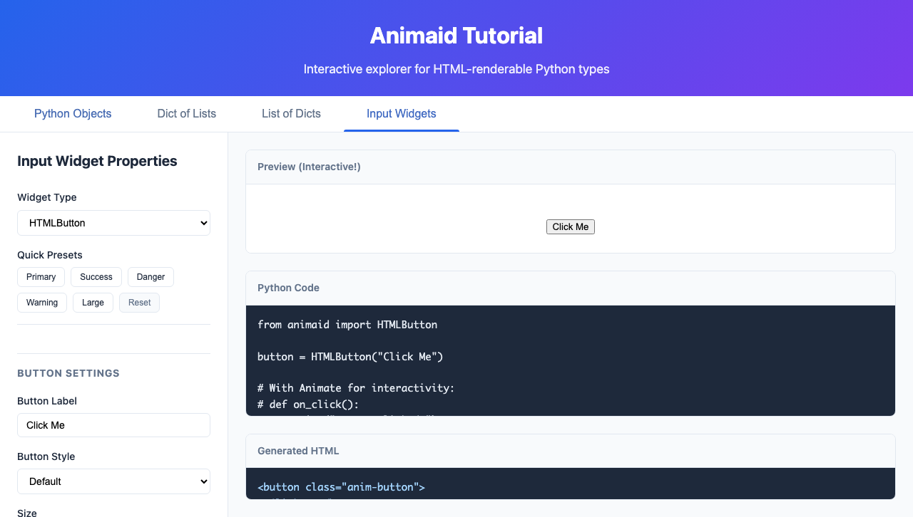

**Containers Tab**
- Layout containers: HTMLRow, HTMLColumn, HTMLCard, HTMLDivider, HTMLSpacer
- Container-specific controls and presets
- Live preview of flexbox layouts
- Generated Python code for each container


**Dict of Lists Tab**
- Visualize nested dictionaries containing lists
- Configure list styling (horizontal, vertical, pills, cards)
- See how nested structures render

**List of Dicts Tab**
- Visualize lists of dictionaries as cards
- Configure card styling and layout
- Perfect for displaying collections of records

### What You Can Do

- **Experiment**: Adjust any property and see instant results
- **Copy Code**: Generated Python code is ready to use in your projects
- **Learn**: See how each style method affects the HTML output
- **Explore Presets**: Quick buttons for common styling patterns

## Contents

```{toctree}
:maxdepth: 2
:caption: Contents

tutorial
demos
input-widgets
containers
api
```

## Indices and tables

- {ref}`genindex`
- {ref}`modindex`
- {ref}`search`
