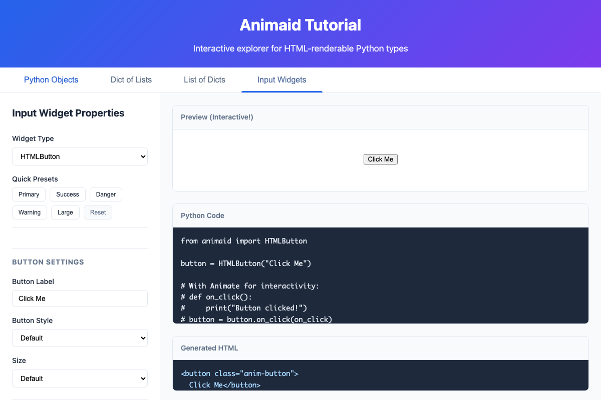

# Interactive Tutorial

AnimAID includes a comprehensive web-based tutorial that lets you explore all features interactively.

## Starting the Tutorial

```bash
# Install with tutorial dependencies
pip install animaid[tutorial]

# Start the tutorial (opens browser automatically)
animaid-tutorial

# Or specify a custom port
animaid-tutorial --port 8300

# Run without opening browser
animaid-tutorial --no-browser
```

## Tutorial Tabs

The tutorial provides five main sections accessible via tabs at the top of the page.

### Python Objects Tab

The Python Objects tab provides a unified interface for exploring all AnimAID HTML types:

- **HTMLString** - Styled text with colors, fonts, backgrounds
- **HTMLInt** - Formatted integers with currency, percentages, ordinals
- **HTMLFloat** - Decimal numbers with precision control and units
- **HTMLList** - Lists with flexible layouts (horizontal, vertical, grid)
- **HTMLDict** - Key-value pairs as tables, cards, or definition lists
- **HTMLTuple** - Tuples with labels and custom separators
- **HTMLSet** - Unique items as tags or pills

Use the dropdown selector to switch between object types. Each type has its own controls and presets.


**Features:**
- Type-specific controls for each HTML object
- Quick preset buttons for common styles
- Live preview of styled output
- Generated Python code you can copy
- Generated HTML output

### Input Widgets Tab

The Input Widgets tab demonstrates interactive input widgets that work with the `App` class:

- **HTMLButton** - Clickable buttons with styles (primary, success, danger, warning)
- **HTMLTextInput** - Text input fields with placeholder and change events
- **HTMLCheckbox** - Toggle checkboxes with labels
- **HTMLSlider** - Range sliders with min/max/step values
- **HTMLSelect** - Dropdown select menus



**Features:**
- Widget-specific controls and presets
- Live demonstration of event handling
- Value display showing current widget state
- Generated Python code for each widget

### Containers Tab

The Containers tab lets you explore layout containers for organizing content:

- **HTMLRow** - Horizontal flexbox layout with alignment options
- **HTMLColumn** - Vertical flexbox layout with alignment options
- **HTMLCard** - Visual grouping with titles, shadows, and borders
- **HTMLDivider** - Visual separators between content sections
- **HTMLSpacer** - Fixed or flexible spacing for layout control


**Features:**
- Container-specific controls and presets
- Live preview of container layouts
- Generated Python code for each container
- Nested layout demonstration

See the [Container Widgets](containers.md) documentation for detailed usage.

### Dict of Lists Tab

Visualize nested dictionaries containing lists:

```python
from animaid import HTMLDict, HTMLList

data = HTMLDict({
    "Fruits": HTMLList(["Apple", "Banana", "Cherry"]),
    "Vegetables": HTMLList(["Carrot", "Broccoli", "Spinach"]),
})
```

Configure list styling options like horizontal/vertical layout, pills, and cards.

### List of Dicts Tab

Visualize lists of dictionaries as cards:

```python
from animaid import HTMLList, HTMLDict

users = HTMLList([
    HTMLDict({"name": "Alice", "role": "Developer"}),
    HTMLDict({"name": "Bob", "role": "Designer"}),
])
```

Perfect for displaying collections of records with consistent formatting.

## What You Can Do

- **Experiment**: Adjust any property and see instant results
- **Copy Code**: Generated Python code is ready to use in your projects
- **Learn**: See how each style method affects the HTML output
- **Explore Presets**: Quick buttons for common styling patterns

## Command Line Options

```
usage: animaid-tutorial [-h] [--port PORT] [--host HOST] [--no-browser]

Run the AnimAID interactive tutorial

options:
  -h, --help    show this help message and exit
  --port PORT   Port to run the server on (default: 8200)
  --host HOST   Host to bind to (default: 127.0.0.1)
  --no-browser  Don't automatically open the browser
```
